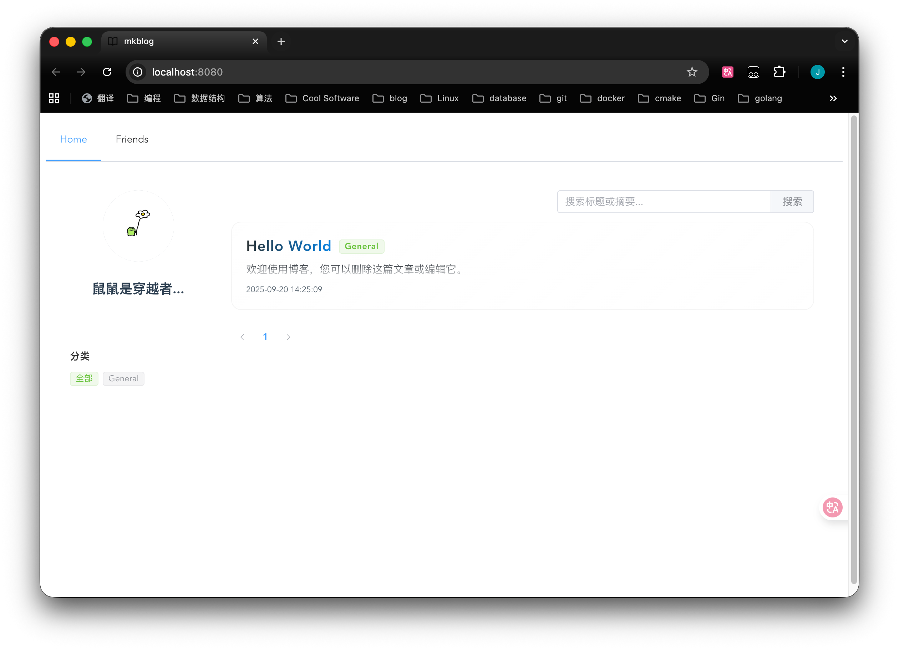
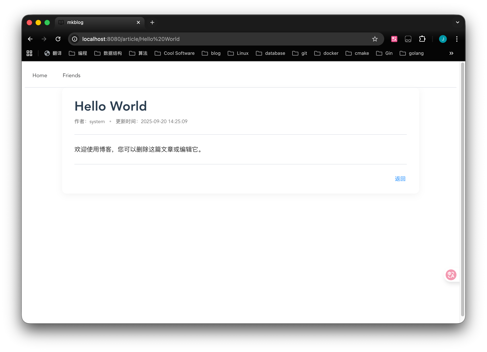
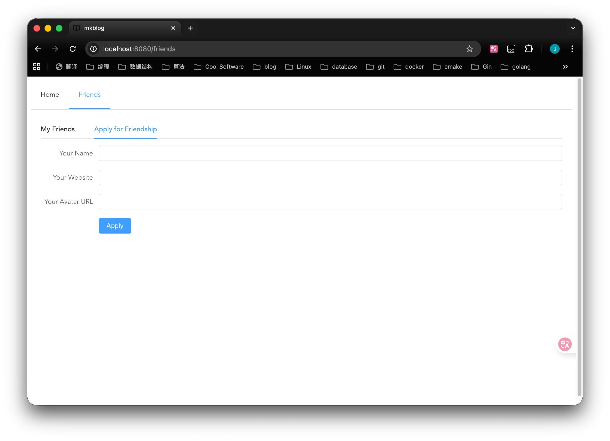

**English Version: [English](README_en.md)**

# mkBlog

一个基于 Go + Gin + GORM + Vue 3 的极简个人博客系统。前后端统一部署，默认使用 SQLite 即可启动，也支持 MySQL / PostgreSQL。项目同时提供 VS Code 和 Obsidian 上传插件，适合以 Markdown 为中心的写作流。

[预览](https://mkitsdts.top:8080)





## 功能特性

- Markdown 文章发布、更新、删除
- 分类筛选与分页展示
- 文章搜索
- 文章评论开关
- 友链展示与申请
- 图片上传并自动转换为 WebP
- 基于 Bearer Token 的写接口鉴权
- 限流、黑名单、Bloom Filter
- TLS / HTTP3 / 自动证书控制
- VS Code / Obsidian 插件上传工作流

## 技术栈

### 后端

- Go 1.24
- Gin
- GORM
- SQLite / MySQL / PostgreSQL

### 前端

- Vue 3
- Vite
- Element Plus
- Axios
- markdown-it
- highlight.js

## 项目结构

```text
.
├── main.go
├── service/               # API 与服务启动
├── pkg/                   # 中间件、缓存、TLS、数据库等
├── frontend/              # Vue 前端
├── plugin/vscode/         # VS Code 上传插件
├── plugin/obsidian/       # Obsidian 上传插件
├── static/                # 前端构建产物
├── docker/                # Dockerfile
└── data/                  # 运行时数据目录（首次启动自动生成）
```

## 运行机制

- 后端启动后会读取 `./data/config.yaml`
- 如果配置文件不存在，程序会自动生成默认配置
- 前端构建产物由后端统一静态托管
- 图片默认保存在 `./data/static/images`
- 空数据库会自动插入一篇 `Hello World` 示例文章

## 快速开始

### 环境要求

- Go 1.24+
- Node.js 20.19+ 或 22.12+，仅构建前端或插件时需要
- SQLite 可直接使用
- MySQL 需要 ngram parser 才能获得更好的全文搜索效果
- PostgreSQL 中文搜索需要 zhparser 扩展

### 1. 构建并启动后端

```bash
go build -o mkBlog .
./mkBlog
```

首次启动会自动生成：

```text
./data/config.yaml
./data/app.db
```

### 2. 修改配置

编辑 `./data/config.yaml`，重点关注以下字段：

- `database.kind`: `sqlite3` / `mysql` / `postgres`
- `database.host`: SQLite 下填写数据库文件名，MySQL / PostgreSQL 下填写主机地址
- `server.port`: 服务端口
- `server.imageSavePath`: 图片保存目录
- `server.devmode`: 是否启用开发模式
- `server.http3_enabled`: 是否启用 HTTP/3
- `tls.enabled`: 是否启用 HTTPS
- `auth.enabled`: 是否启用 Bearer Token 鉴权
- `auth.secret`: 写接口使用的 Token
- `site.signature`: 首页签名
- `site.about`: 关于页面内容
- `site.avatarPath`: 头像文件名
- `site.server`: 对外访问地址
- `site.comment_enabled`: 是否开启评论
- `site.icp`: 备案号

### 3. 构建前端

```bash
cd frontend
npm install
npm run build
```

前端构建完成后，需要把产物复制到仓库根目录的 `static/` 下供后端托管。

### 4. 访问项目

默认访问地址：

```text
http://127.0.0.1:4801
```

如果正确设置了 `site.server`，前端会使用该地址作为生产环境 API 根地址。

## 数据库说明

### SQLite

- 默认方案
- 无需额外安装数据库
- 搜索功能使用 LIKE 回退方案

### MySQL

- 适合正式部署
- 搜索依赖 FULLTEXT + ngram parser

### PostgreSQL

- 支持中文搜索
- 需要安装 zhparser 扩展

## API 概览

### 公开接口

- `GET /api/site`
- `GET /api/articles`
- `GET /api/allarticles`
- `GET /api/article/:title`
- `GET /api/search`
- `GET /api/categories`
- `GET /api/friends`
- `POST /api/friends`
- `GET /api/comments`
- `POST /api/comments`

### 管理接口

- `PUT /api/article/:title`
- `PUT /api/image`
- `DELETE /api/article/:title`
- `POST /api/blockip`

当 `auth.enabled: true` 时，上述管理接口需要携带：

```http
Authorization: Bearer <your-token>
```

## 图片与 Markdown 约定

- 图片按文章标题归档保存
- 非 WebP 图片上传后会自动转为 `.webp`
- 文内引用图片时可以不写扩展名
- 如果手动写扩展名，建议写 `.webp`
- 插件默认会上传 Markdown 文件以及同名文件夹中的图片资源

## 插件

### VS Code

见 [plugin/vscode/README.md](plugin/vscode/README.md)

### Obsidian

见 [plugin/obsidian/README.md](plugin/obsidian/README.md)

## Docker

```bash
docker build -f docker/Dockerfile -t mkblog:latest .
docker run -d --name mkblog -p 4801:4801 -v /etc/mkblog:/app/data mkblog:latest
```

容器中的运行数据会保存在 `/app/data`。

## 在线安装与更新

如果你不想使用 Docker，可以直接通过安装脚本把 mkBlog 安装到本地并注册为系统服务。

### 前置要求

- Git
- Go 1.24+
- Node.js 20.19+ 或 22.12+
- npm
- make
- Linux 下需要 `systemd`
- macOS 下需要 `launchd`

### 安装

```bash
curl -fsSL https://raw.githubusercontent.com/mkitsdts/mkBlog/main/scripts/install.sh | bash -s -- install
```

### 更新

```bash
curl -fsSL https://raw.githubusercontent.com/mkitsdts/mkBlog/main/scripts/install.sh | bash -s -- update
```

### 常用命令

```bash
curl -fsSL https://raw.githubusercontent.com/mkitsdts/mkBlog/main/scripts/install.sh | bash -s -- start
curl -fsSL https://raw.githubusercontent.com/mkitsdts/mkBlog/main/scripts/install.sh | bash -s -- stop
curl -fsSL https://raw.githubusercontent.com/mkitsdts/mkBlog/main/scripts/install.sh | bash -s -- restart
curl -fsSL https://raw.githubusercontent.com/mkitsdts/mkBlog/main/scripts/install.sh | bash -s -- status
curl -fsSL https://raw.githubusercontent.com/mkitsdts/mkBlog/main/scripts/install.sh | bash -s -- uninstall
```

### 可选环境变量

- `MKBLOG_INSTALL_DIR`: 安装目录，默认 `~/.local/share/mkblog`
- `MKBLOG_REPO_URL`: 仓库地址
- `MKBLOG_REPO_REF`: 分支或标签，默认 `main`
- `MKBLOG_SERVICE_NAME`: Linux 下的 systemd 服务名，默认 `mkblog`
- `MKBLOG_LAUNCHD_LABEL`: macOS 下的 launchd label，默认 `com.mkblog.app`

## CI/CD

- `main` 分支更新时，只有代码相关目录、Docker 文件或 GitHub Actions 工作流发生变更，才会触发服务器部署
- 部署工作流会在服务器上执行 `make release`
- GitHub Release 发布后，会自动构建并推送 `linux/amd64` 与 `linux/arm64` 多架构镜像到 Docker Hub
- `docker/**` 或 `.github/workflows/**` 在 `main` 分支变化时，也会自动触发镜像构建与推送

## 说明

- 前后端同源部署，默认不存在 CORS 问题
- 如需 HTTPS，可启用 `tls.enabled`
- 如需自动签发证书，可配置 `cert_control`
- VS Code 和 Obsidian 插件都支持通过配置 Base URL 连接远端博客服务

## License

[MIT](LICENSE)
