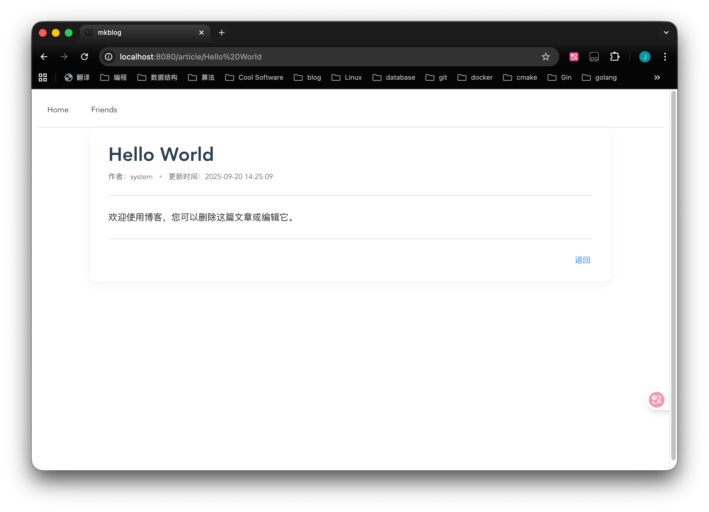

**English Version: [English](README_en.md)**

# mkBlog

 Go 开发的极简个人博客系统，专注于内容创作和技术积累，一键部署前后端。

 [预览](https://mkitsdts.top:8080)





## 项目介绍

mkBlog 是一个轻量级的个人博客系统，支持 Markdown 文章、文章分类。系统设计简洁，易于部署和维护。

## 使用说明

修改头像,个性签名和自我介绍可以在 [配置文件](config.yaml) 里进行，修改对应 site 下的值

编写博客时，如果有带图片，路径不需要填写后缀，如果填写后缀需要填写 webp ，因为后端接收图片时会将图片转换成 webp 格式。

目前上传文件的方案是通过 vscode 插件作为一个后台管理，通过填写地址实现对博客的增删改。[插件](plugin) 可以自行编译或者选择发行版的插件。

## 技术栈

- **Go 1.24** - 主要编程语言
- **Gin** - Web 框架
- **GORM** - ORM 框架
- **MySQL 或 Postgres** - 数据库

## 功能特性

- ✅ **文章管理** - 支持 Markdown 格式文章的创建、编辑和展示
- ✅ **文章分类** - 按分类组织文章内容
- ✅ **文章搜索** - 支持关键词搜索文章
- ✅ **分页显示** - 文章列表分页展示
- ✅ **友链管理** - 友链展示和申请功能
- ✅ **图片支持** - 文章内图片展示
- ✅ **文章评论** - 文章下评论及展示功能

新增： vscode 插件管理博客，在 plugin 文件夹下，目前实现了文章及图片的创建，删除，以及 md 文件的标签解析，但文章检查，排版等都还不完善，所以暂时不上架。后续的计划是在 vscode 端通过插件的形式实现博客后端管理，包括文章图片的创建，上传，删除，再做一定的格式检查。

添加布隆过滤器，限流器，并加入黑名单模式。

## 快速开始

### 环境要求
- Go 1.24+
- MySQL 8.0+ （需要 ngram 分词器） 或 Postgres 18.0+ （需要 zhparser 插件）

### 真机部署

1. **配置数据库**
   ```bash
   # 创建数据库
   CREATE DATABASE mkblog CHARACTER SET utf8mb4 COLLATE utf8mb4_unicode_ci;
   ```

2. **配置文件**
   
在 `config.yaml` 里，前往 [配置文件](config.yaml) 查看注释

3. **启动服务**

最直接的方式是使用 Makefile ， 一行 make all 搞定

也可通过 github action 实现自动化部署。需要在 github 里配置秘密参数

或者 go build 编译成二进制文件后部署

### Docker 部署

**数据库 Docker 部署：**
如果使用 docker 部署需要注意写入环境变量
```bash
cd docker
docker-compose up -d
```

## 访问地址

前后端统一地址，所以没有跨域问题

建议使用 Let's Encrypt ，可以自动续费，一劳永逸。

如果需要配置 TLS 证书，可以在 config.yaml 里 tls 配置项的 enabled 选项打开，然后把 TLS 证书拷贝到 static 文件夹下