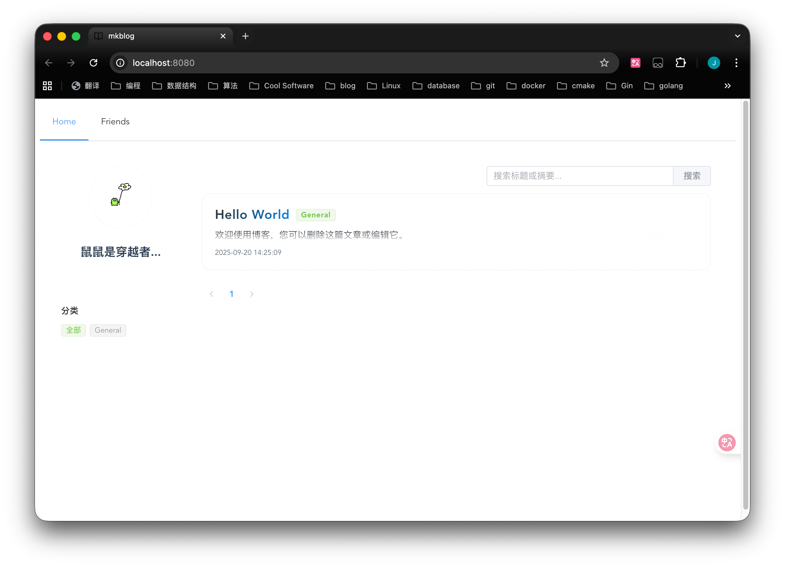
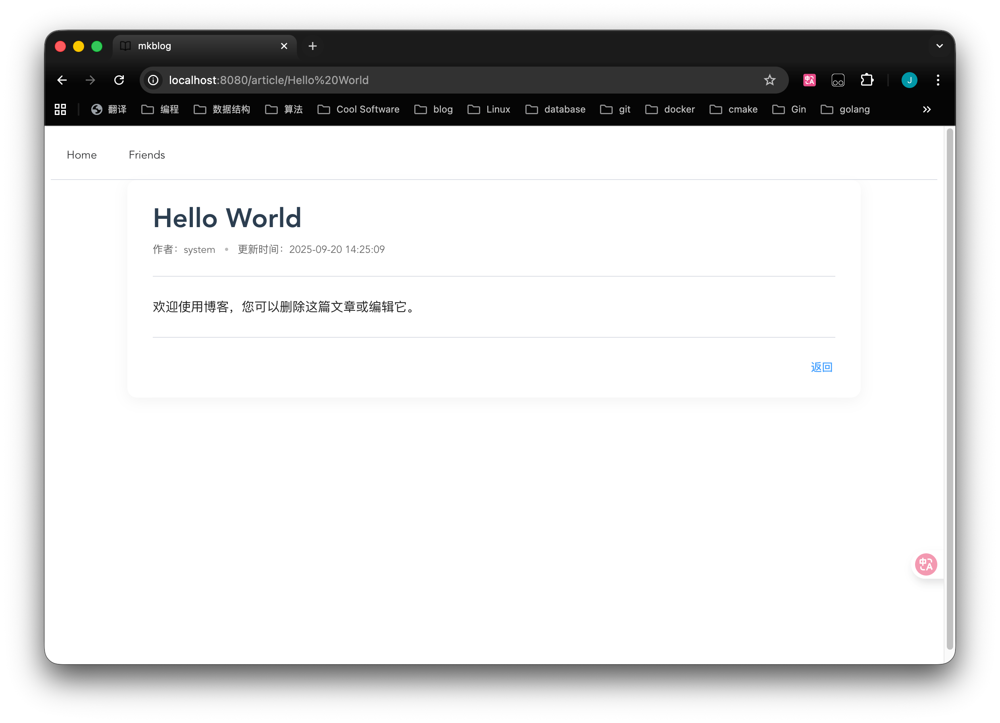
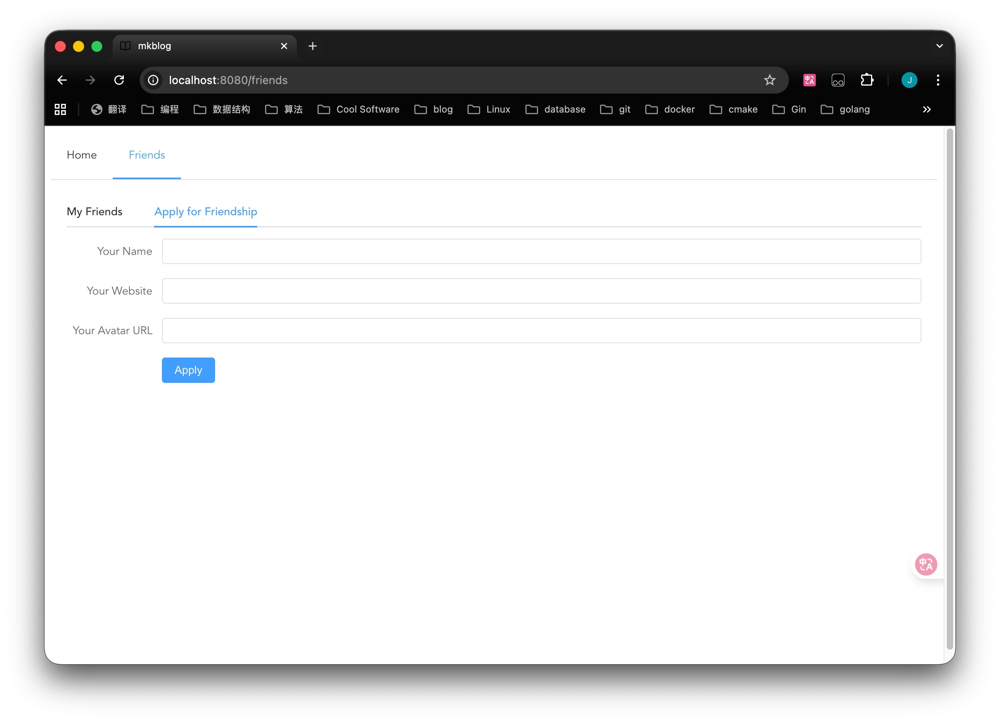

**中文版本: [中文](README.md).**

**Chinese Version: [中文](README.md)**

# mkBlog

A minimal personal blog system written in Go, focused on content creation and knowledge accumulation. One-step deployment for backend and frontend.







## Overview

mkBlog is a lightweight personal blogging system supporting Markdown articles and categories. It is simple in design, easy to deploy, and easy to maintain.

## Tech Stack

- **Go 1.24** – Language
- **Gin** – Web framework
- **GORM** – ORM
- **MySQL** – Database

## Features

- ✅ Articles: Create, edit, render Markdown
- ✅ Categories: Organize articles
- ✅ Search: Keyword search
- ✅ Pagination: Paged list
- ✅ Friend links: Listing & application
- ✅ Image management

## Quick Start

### Requirements
- Go 1.24+
- MySQL 8.0+(need ngram)

### Native Deployment

1. Database
   ```bash
   CREATE DATABASE mkblog CHARACTER SET utf8mb4 COLLATE utf8mb4_unicode_ci;
   ```

2. Config (`backend/config.yaml`)

see config file and it's easy enough.

3. Run
   ```bash
   go mod tidy
   go run main.go
   ```

### Docker

```bash
cd docker
docker-compose up -d
```

## Usage

- Upload articles: use CLI tool `mkblog push` (write Markdown with front matter)

## Access

Unified frontend & backend:
```
http://localhost:8080
```

TLS:
- If using built‑in (manual cert): enable in config and place cert/key in `static/`
- Or prefer reverse proxy (Nginx/Caddy) or CDN (Cloudflare)

## Roadmap

- [x] Basic article system
- [x] Categories & search
- [x] Friend links
- [x] Responsive UI
- [ ] Comments
- [ ] RSS feed
- [ ] RSS feed
- [ ] SEO optimization